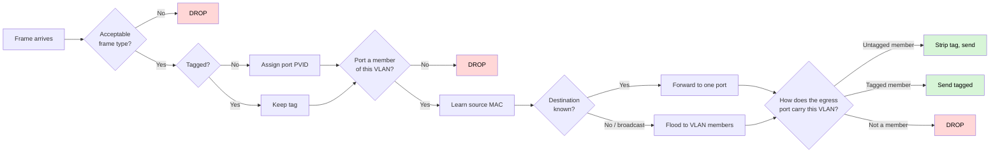

# network-sandbox

A browser-only sandbox for **IEEE 802.1Q / 802.1D bridging**, plus documented models of routing, NAT, DHCP, ARP, resolver lookup and ISP handoff. Build a topology, send a frame, read the engine's hops.

There is **no server and no account**. Open **https://alanfong93.github.io/network-sandbox/** in a clean browser, place a box, and Send. That path needs no Node and no Docker. The hosted copy is this repository (AGPL). A clone still needs Node.js 22+. Sharing a topology file still keeps credentials in the file ([#65](https://github.com/alanfong93/network-sandbox/issues/65)).

A trace supports design review. It does **not** certify a production design, and it does **not** emulate any vendor's defaults.

> **What this promises, and what it doesn't**
>
> Fidelity is scoped to the implemented 802.1Q/802.1D bridge pipeline. Routing, NAT, DHCP, ARP, resolver and ISP behaviour are the models in this repo, not a copy of your box. You still translate a working design into vendor syntax and check that vendor's defaults.

**Status:** Stages 1–3 of the engine are in the library (wired core, access points as wired devices, multi-WAN). Stage 4 has the estimate/trace seam and optional `Radio.channel`; coverage is not modelled. Stage 5 is a first browser UI (forms plus an SVG canvas). A versioned profile document and registry exist in the engine; the author does not ship vendor profile content, and the UI has no profile picker. Who it is for is in [`docs/PRODUCT.md`](docs/PRODUCT.md); the spec is [`docs/SPEC.md`](docs/SPEC.md); decisions in [`docs/adr/`](docs/adr/); vocabulary in [`CONTEXT.md`](CONTEXT.md).

## Run it

**Hosted:** https://alanfong93.github.io/network-sandbox/

To work from a clone, you need **Node.js 22+**.

```bash
npm ci
npm test
npm run typecheck
npm run build
npm run ui:build

npm run ui:dev
```

Open **http://localhost:5173**. Place a box from the palette (or drop it on the canvas), cable two ports, set PVID / untagged VLANs in the inspector, Send, and read the hops. The canvas also steps a replay token along those hops (play/step, no verdict). **Load missing-return-route starter** loads catalogue row 13 (NAT off, no return route) without changing the NAT-on default for a newly placed router.

Docker is an **optional** way to serve the same static UI, not a prerequisite:

```powershell
.\build_container.ps1        # http://localhost:5173  (nginx on 80, mapped to 5173)
```

The `network-sandbox` package is **`private`**. There is no supported npm/Node consumer path and `dist/` is not a published ESM API.

---

## The idea

Build a topology, configure it, then try something and see exactly what happened. This example is **catalogue row 1** (`src/catalogue.ts`, asserted in `src/catalogue.test.ts` and `src/walk.test.ts`): VLAN 20 is missing from SW2 port 3's membership, so a known-unicast frame drops at egress.

```
Dropped at SW2 port 3 (egress): port is not a member of VLAN 20
```

That sentence is `format()` output, not hand-written prose. PVID classifies **ingress** traffic onto a VLAN; it does not by itself place a tag on the wire. Egress tagged/untagged is membership (`untaggedVlans`).

**A trace, never a verdict.** A green tick invites blind trust, and blind trust in a simulator is how someone breaks a production network. Showing each step lets you check the reasoning — which is also what makes it useful for learning.

## Why it isn't just a pile of if-statements

The obvious objection to a hand-written network simulator is that it encodes *the author's beliefs* about networking. That objection is fatal to a rulebook (`if trunk && !tagged then error`), so this doesn't do that.

Instead the bridge path executes the **802.1Q ingress → forward → egress pipeline**: acceptable frame types, PVID assignment, ingress filtering, MAC learning, flood-within-VLAN, then the egress tagged/untagged decision. That pipeline is finite, published, and vendor-neutral.



## Capability matrix

Palette labels come from `ui/presets.ts`. **Engine** means the TypeScript library can produce hops. **Browser editor** means the shipped UI can place or edit it. **Planned** is not configurable in the UI today.

| Capability | Engine | Browser editor | Planned |
|---|---|---|---|
| Host | yes | palette | |
| Managed switch (bridge + STP) | yes | palette; mode, PVID (ingress), untagged/tagged VLANs, STP priority | |
| Unmanaged switch | yes | palette; VLAN membership controls hidden | |
| Router (routing, NAT, DHCP, firewall) | yes | palette; LAN/WAN jack counts, iface VLAN, NAT, inter-VLAN firewall | |
| L3 switch | yes | palette; SVI VLAN is not an independent inspector control | |
| Access point (SSID → VLAN) | yes | palette; SSID, VLAN | |
| ISP modem (PPPoE / tagged WAN) | yes | palette | |
| Standalone DHCP server | yes | palette | |
| DNS server (resolver table) | yes | palette | |
| Internet box | yes | palette | |
| Canvas drop / port-click cable / drag, hop replay | — | yes | |
| Sandbox JSON import/export | yes | Export file / Import | |
| Profile document + registry | yes (`fromProfileJson`) | no picker | vendor/ISP content, UI picker |
| Radio coverage | estimate seam + `Radio.channel` only | channel is config | coverage UI |
| Share-safe export | credentials kept in the file | same | [#65](https://github.com/alanfong93/network-sandbox/issues/65) |

Routers are **one device type placed at any depth**. "Sub-router" is a position, not a kind of box.

## Persistence

Sandbox JSON (`format: 'network-sandbox'`, version 1) is the file you keep. It round-trips the topology, including `isp-handoff` **credentials**. Check a file before you share it. That policy is a standing guard, not a feature request: [#65](https://github.com/alanfong93/network-sandbox/issues/65). Canvas `x,y` is an optional envelope sibling, not Topology.

Vendor and ISP **profile content** is not shipped. The engine can load a version-1 profile document; the UI does not pick files yet.

## Roadmap

1. **Wired core** - done.
2. **Access points** - done.
3. **Multi-WAN** - done.
4. **Radio** - last. Estimate/trace seam and channel-as-config are in; coverage, roaming and a distinct UI are not.
5. **Browser UI** - started. Palette, inspector, send, sandbox JSON, SVG canvas (drop, port-click link, drag), hop replay. Forms UI stays.

Stage 4 is deliberately last. See below.

## What it does not model

No timers. The sandbox computes the *converged* state, so it will not tell you how long a network is down while spanning tree reconverges — a design that settles here can still black-hole traffic for ~30 seconds on real hardware.

Single-instance STP only, not per-VLAN (PVST+/MSTP).

**Honesty boundary around wireless:** SSID-to-VLAN mapping is configuration. **Radio coverage is not.** When coverage modelling arrives it will be presented differently from the rest of the tool, because it is an estimate and the rest is not.

## Contributing

Contributions are welcome. Sign your commits off with `git commit -s` — see
[`CONTRIBUTING.md`](CONTRIBUTING.md).

You keep the copyright on what you write. There is **no CLA**. That does not grant the maintainer an extra right to relicense another contributor's work. Relicensing the whole project requires every relevant copyright holder. See [ADR 0014](docs/adr/0014-agpl-with-dco-no-cla.md).

## Licence

Copyright (C) 2026 Alan Fong

This program is free software: you can redistribute it and/or modify it under the
terms of the **GNU Affero General Public License** as published by the Free Software
Foundation, either version 3 of the License, or (at your option) any later version.

It is distributed in the hope that it will be useful, but **WITHOUT ANY WARRANTY** —
without even the implied warranty of MERCHANTABILITY or FITNESS FOR A PARTICULAR
PURPOSE. See the [GNU AGPL](LICENSE) for details.

AGPL governs use and source obligations, including the network clause: anyone who
modifies this tool and lets others interact with it over a network has to publish
those changes. It does not make private modification categorically impossible.

The licence covers this project's code. It does not claim ownership of vendor or ISP
**profiles** that users write — those belong to their authors.
