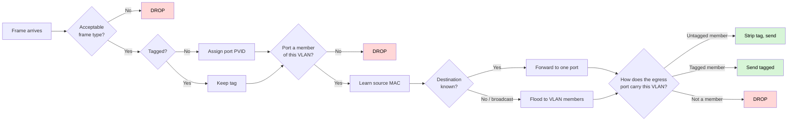

# network-sandbox

A browser-based network sandbox for trying out switch, router and VLAN configuration safely — so you can test a change before you make it on real gear.

Everything runs in the browser. No server, no account, no install.

> ### What this promises, and what it doesn't
>
> **If your design works here, the design is sound — you still translate it to your box's syntax and check its defaults.**
>
> It does *not* promise that anything working here will work identically on your specific switch. Vendors differ in syntax, defaults and edge-case behaviour, and those differences are where a lot of real outages live. This sandbox is faithful to **IEEE 802.1Q / 802.1D** — the standard every vendor implements — not to any one vendor's box.

**Status: Stage 1 in progress.** The engine is a dependency-free TypeScript library — types, the failure catalogue, `format`, defaults, converged STP, one 802.1Q bridging pass, a topology walk that floods as a tree under a global hop budget, hosts, ARP, routing, the inter-VLAN firewall, a flow driver that traces a request and its reply against one run context, NAT (masquerade plus port forwards), DHCP (DISCOVER/OFFER/REQUEST/ACK, no leases), the ISP handoff (PPPoE over a tagged WAN), a fixture profile seam, and the wired reference scenario. Who it is for is in [`docs/PRODUCT.md`](docs/PRODUCT.md); the spec is [`docs/SPEC.md`](docs/SPEC.md); decisions in [`docs/adr/`](docs/adr/); vocabulary in [`CONTEXT.md`](CONTEXT.md).

```bash
npm install
npm test
npm run build
```

---

## The idea

Build a topology, configure it, then try something and see exactly what happened:

```
PC1  -> sends frame, untagged
SW1  -> port 1 receives it, tags it VLAN 10  (port's PVID)
SW1  -> looks up PC2's address in VLAN 10... not found
SW1  -> floods to all VLAN 10 ports: only port 1. Nowhere to send.
        DROPPED - PC2 is on VLAN 20, not VLAN 10
```

**A trace, never a verdict.** A green tick invites blind trust, and blind trust in a simulator is how someone breaks a production network. Showing each step lets you check the reasoning — which is also what makes it useful for learning.

## Why it isn't just a pile of if-statements

The obvious objection to a hand-written network simulator is that it encodes *the author's beliefs* about networking. That objection is fatal to a rulebook (`if trunk && !tagged then error`), so this doesn't do that.

Instead it executes the actual **802.1Q ingress → forward → egress pipeline**: acceptable frame types, PVID assignment, ingress filtering, MAC learning, flood-within-VLAN, then the egress tagged/untagged decision. That pipeline is finite, published, and vendor-neutral. The result isn't an opinion — it's what the standard says happens.



## Devices

Each one exists to let you make a specific real-world mistake.

| Device | Configurable | The mistake it lets you make |
|---|---|---|
| **Unmanaged ("dumb") switch** | nothing | No VLAN awareness at all. The honest answer to *"why isn't my VLAN working?"* |
| **Managed switch** | access/trunk, PVID, allowed VLANs, STP priority | Untagged trunk, native VLAN mismatch, VLAN missing from the allowed list |
| **L3 switch** | the above, plus routing between VLANs | Router-on-a-stick vs. L3 switch, and getting the SVI wrong |
| **Router** (at any depth) | inter-VLAN routing, DHCP per VLAN, firewall, NAT on/off | Gateway on the wrong VLAN, DHCP with no relay, **missing return route**, double NAT |
| **DHCP server** (standalone) | scopes per VLAN | The server sitting on a different VLAN from the clients asking |
| **Access point** | SSID to VLAN mapping, management VLAN | Guest wifi leaking into the main network; AP unreachable after a native VLAN change |

Routers are **one device type placed at any depth** — HQ, floor, department. "Sub-router" is a position in the topology, not a kind of box. The real decision at each tier is NAT on or off, and the two worlds fail very differently.

## Roadmap

1. **Wired core** — switches, routers, hosts, DHCP both router-based and standalone
2. **Access points** — SSID to VLAN mapping and wireless clients, reusing the wired engine
3. **Multi-WAN** — policy routing per VLAN, then failover, then load balancing
4. **Radio** — signal, channels, coverage, roaming

Stage 4 is deliberately last. See below.

## What it does not model

No timers. The sandbox computes the *converged* state, so it will not tell you how long a network is down while spanning tree reconverges — a design that settles here can still black-hole traffic for ~30 seconds on real hardware.

Single-instance STP only, not per-VLAN (PVST+/MSTP). Vendor-specific syntax and defaults are out of scope for now.

**And a deliberate honesty boundary around wireless:** SSID-to-VLAN mapping is configuration, and it carries the same confidence as everything else here. **Radio coverage does not.** Whether an AP reaches the far end of an office depends on walls, materials, antenna patterns and the neighbours' networks; no standard answers that, a site survey does. When coverage modelling arrives it will be presented differently from the rest of the tool, because it is an estimate and the rest is not.

## Contributing

Contributions are welcome. Sign your commits off with `git commit -s` — see
[`CONTRIBUTING.md`](CONTRIBUTING.md).

You keep the copyright on what you write. There is **no CLA**, and nobody can
relicense this project or take it closed — including the maintainer. That is
deliberate: see [ADR 0014](docs/adr/0014-agpl-with-dco-no-cla.md).

## Licence

Copyright (C) 2026 Alan Fong

This program is free software: you can redistribute it and/or modify it under the
terms of the **GNU Affero General Public License** as published by the Free Software
Foundation, either version 3 of the License, or (at your option) any later version.

It is distributed in the hope that it will be useful, but **WITHOUT ANY WARRANTY** —
without even the implied warranty of MERCHANTABILITY or FITNESS FOR A PARTICULAR
PURPOSE. See the [GNU AGPL](LICENSE) for details.

AGPL was chosen so that anyone who modifies this tool — **including anyone who merely
hosts a modified copy** — has to publish their changes. Contributors give their work
freely; nobody gets to take it private.

The licence covers this project's code. It does not claim ownership of vendor or ISP
**profiles** that users write — those belong to their authors.
