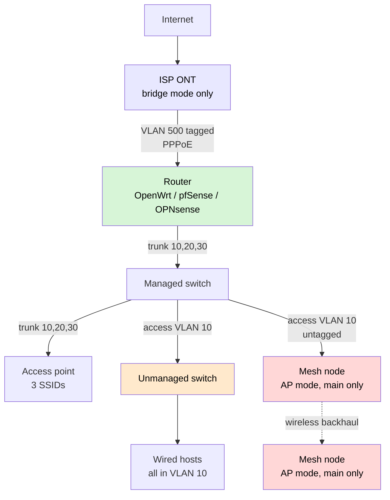

# v1 Spec

Design document. The engine skeleton, run context, spanning tree, 802.1Q
bridging pass, topology walk, hosts, ARP, routing, the inter-VLAN firewall,
the request/reply flow driver, NAT, DHCP (server and relay as a
message exchange), the ISP handoff (PPPoE and a tagged WAN), a fixture
profile seam, the reference scenario (including AP and mesh), wireless
dispatch at `ssid-vlan`, a tagged AP uplink, and AP management as
ordinary host addressing exist.

This file describes *what* v1 is, and it gets archived when the phase closes. The
*why* behind the load-bearing decisions lives in [`adr/`](adr/) and outlives it —
0001 pipeline-not-rulebook, 0002 trace-not-verdict, 0003 no-timers, 0004 one router
type, 0005 NAT on by default, 0006 radio is an estimate, 0007 unmanaged-switch names a
capability, 0008 PVID is ingress and native VLAN is egress, 0009 browser-only not a real
dataplane, 0010 ARP is modelled without a cache, 0011 single-instance STP owes a warning,
0012 profiles are data and the engine is the only executor,
0013 a device is a chassis plus functions, 0014 AGPL-3.0 with a DCO,
0015 read real config before generating it,
0016 TypeScript + Vitest with no runtime framework,
0017 structure in engine tests and wording against the catalogue table,
0018 services are reached not answered.
Reversing any of those means
appending a new ADR that supersedes the old one, not editing this file quietly.

## 1. Principle

Execute the **802.1Q ingress → forward → egress pipeline**, and let outcomes fall out of it. Do not write a rulebook of hand-authored error conditions — the pipeline is finite, published and vendor-neutral, so running it produces the standard's answer rather than the author's.

Ingress: acceptable frame types → assign PVID if untagged → ingress filtering (is the port a member of this VLAN?).
Forward: learn source MAC into the per-VLAN FDB → look up destination → forward to one port, or flood to VLAN member ports.
Egress: untagged member → strip tag; tagged member → send tagged; not a member → drop.

Every drop is simultaneously a teaching moment and a bug report. The UI's job is to name which step the frame died at.

## 2. Data model

A device is a **chassis plus functions** — see [ADR 0013](adr/0013-devices-are-a-chassis-plus-functions.md).
The palette shows boxes ("Home router with WiFi"); the functions live underneath.

```ts
type VlanId  = number;           // 1..4094
type MacAddr = string;           // "aa:bb:cc:dd:ee:01"
type Bytes   = number;
type DeviceId = string;
type FnId     = string;

// ---------- topology ----------

interface Topology {
  devices: Chassis[];
  links: Link[];
  profiles: string[];            // profile ids in use - ADR 0012
}

// ONE link type. A wireless link carries VLANs exactly like copper and carries
// NO RF semantics: no signal, no rate, no coverage. It is an ASSUMPTION the UI
// must label as such. RF is stage 4 and is an estimate - ADR 0006, ADR 0013.
interface Link {
  id: string;
  a: { device: DeviceId; port: string };
  b: { device: DeviceId; port: string };
  medium: 'wired' | 'wireless';
  up?: boolean;                  // omitted = up. Down is a LINK property: the walk
                                 // does not traverse it, STP computes as if it were
                                 // not drawn, and a route whose via sits behind it
                                 // is not a candidate - ADR 0020. Failover is two
                                 // runs of one topology (ADR 0003).
}

// ---------- the box ----------

interface Chassis {
  id: DeviceId;
  label: string;                 // what the palette called it
  preset?: string;               // the profile it was created from - ADR 0012
  ports: Port[];
  radios: Radio[];
  functions: Fn[];
  internal: InternalEdge[];      // generated from the preset; inspectable, not user-rewirable
  mac?: MacAddr; ip?: string; prefix?: number; gateway?: string;
  vlan?: VlanId;                 // host addressing — not a function (ADR 0013).
                                 // `vlan` is the VLAN that addressing answers on
                                 // (management on a trunked AP). No new pipeline step.
}

interface Port {
  id: string;
  mtu: Bytes;                    // usable size is COMPUTED from encapsulation, never stored
  ownedBy: FnId;                 // a port is a bridge member, a routed iface, or a WAN
}

// A radio exists so several wireless functions can share ONE radio - that is what
// makes an extender an extender. It deliberately has NO power/channel-quality
// fields: those are stage 4 estimates.
interface Radio {
  id: string;
  band: '2.4' | '5' | '6';
}

interface InternalEdge { from: FnId | string; to: FnId | string; }

// ---------- functions ----------

type Fn =
  | { kind: 'bridging'; id: FnId; vlanAware: boolean;
      canTag?: boolean;                                        // false -> cannot emit 802.1Q tags (consumer mesh)
      members: BridgePort[]; fdb: Map<string, string> }        // vlanAware=false -> one flat, VLAN-blind table
  | { kind: 'stp'; id: FnId; bridge: FnId; priority: number; baseMac: MacAddr;
      // Keyed by instance. v1 ships exactly ONE instance (ADR 0011); MSTP (802.1s)
      // adds more without a model change. Build MSTP before PVST+ - ADR 0012.
      state: Map<string, Map<string, 'forwarding' | 'blocking' | 'disabled'>> }
  | { kind: 'routing'; id: FnId; ifaces: RouterIface[]; routes: Route[];
      firewall: { from: VlanId; to: VlanId; action: 'allow' | 'deny' }[] }
  | { kind: 'nat'; id: FnId; on: FnId;
      portForwards: { proto: 'udp' | 'tcp'; outsidePort: number; toIp: string; toPort: number }[] }
  | { kind: 'dhcp-server'; id: FnId; scopes: DhcpScope[] }
  | { kind: 'dhcp-relay'; id: FnId; helper: string }
  | { kind: 'wireless'; id: FnId; radio: string;                // several may share one radio
      mode: 'ap' | 'client' | 'mesh'; ssid: string; vlan?: VlanId }
  | { kind: 'isp-handoff'; id: FnId; port: string;              // several = multi-WAN
      mode: 'pppoe' | 'dhcp' | 'static';
      vlanTag?: VlanId;                                         // TM unifi tags VLAN 500 here
      credentials?: { user: string; pass: string }; ip?: string; prefix?: number };

interface BridgePort {
  port: string;
  mode: 'access' | 'trunk';
  // INGRESS ONLY: the VLAN an accepted untagged frame enters. NOT the native VLAN -
  // native is egress and lives in untaggedVlans. Independent. ADR 0008.
  pvid: VlanId;
  taggedVlans: Set<VlanId>;      // EGRESS: sent tagged
  untaggedVlans: Set<VlanId>;    // EGRESS: sent untagged. A trunk's "native VLAN" is
                                 // this set's single entry - derived, never stored.
  acceptableFrameTypes: 'all' | 'tagged-only' | 'untagged-only';
  ingressFiltering: boolean;
}

interface RouterIface {
  id: string;
  vlan?: VlanId;                 // a TAGGED SUB-INTERFACE on a routed port - no bridge involved
  ip: string; prefix: number;
  mac: MacAddr;                  // so the sub-interface can answer ARP
}

interface Route {
  dest: string; prefix: number; via: string;
  fromVlan?: VlanId;             // present = policy routing (multi-WAN), absent = destination-only
}

interface DhcpScope { vlan: VlanId; poolStart: string; poolEnd: string; gateway: string; resolver: string }

// ---------- what moves ----------

interface Frame {
  srcMac: MacAddr; dstMac: MacAddr;
  vlan: VlanId | null;                    // null = untagged on the wire
  size: Bytes;                            // MTU failures are invisible without this
  encapsulation: ('ethernet' | 'vlan-tag' | 'pppoe')[];   // each costs bytes; the
                                          // usable MTU is COMPUTED from this stack,
                                          // never typed in as 1492 - ADR 0001
  payload:
    | { kind: 'arp' | 'icmp'; srcIp?: string; dstIp?: string }
    | { kind: 'dhcp'; srcIp?: string; dstIp?: string; dhcpType?: string }
    | { kind: 'service'; proto: 'udp' | 'tcp'; dstPort: number;
        srcIp?: string; dstIp?: string; srcPort?: number };
  hops: Hop[];                            // appended everywhere - this IS the explanation
}

// ReasonCode is exactly `step:outcome`. Adding a code requires adding a step
// or an outcome, never a scenario (ADR 0001, ADR 0017).
type PipelineStep =
  | 'acceptable-frame-types' | 'pvid-assignment' | 'ingress-filtering'
  | 'stp-ingress' | 'source-learning' | 'destination-lookup' | 'hop-budget'
  | 'stp-egress' | 'egress-membership' | 'egress-tagging'
  | 'arp' | 'route-lookup' | 'firewall' | 'nat' | 'port-forward'
  | 'dhcp-server' | 'dhcp-relay' | 'isp-handoff' | 'mtu' | 'delivery'
  | 'ssid-vlan';                 // stage 2
type Outcome =
  | 'forwarded' | 'flooded' | 'dropped' | 'delivered'
  | 'admitted' | 'classified' | 'learned' | 'translated' | 'relayed';
type ReasonCode = `${PipelineStep}:${Outcome}`;

interface Hop {
  device: DeviceId;
  fn?: FnId;                     // WHICH FUNCTION inside the box handled it - no black
                                 // holes inside a combo device (ADR 0013)
  inPort?: string; outPort?: string;
  vlan: VlanId | null;
  action: 'forwarded' | 'flooded' | 'dropped' | 'delivered';
  step: PipelineStep;            // the pipeline stage that decided this hop
  reasonCode: ReasonCode;        // structured; engine tests read this
  reason: string;                // format() output — user-facing copy (ADR 0002)
  // Present when a profile influenced this step. Standard-derived output must never
  // appear to endorse a third party's claim - ADR 0012.
  provenance?: { profile: string; version: string; fields: string[] };
}

// Catalogue rows 9, 13 and 15 are about a REPLY dying, not a request. One frame in one
// direction cannot show that, so what the user traces is a FLOW.
interface Flow {
  id: string;
  request: Frame;
  reply?: Frame;                 // absent = nothing came back, which is itself the finding
  outcome: 'round-trip'          // request delivered, reply returned
         | 'request-failed'      // it never arrived
         | 'reply-failed';       // it arrived; the reply died coming back - row 13
  asymmetric?: boolean;          // the reply took a different path - row 15
}

// A looped frame would trace forever. The engine stops here, and the count IS how a
// broadcast storm is shown - catalogue row 6.
const MAX_HOPS = 100;
```

### How the real boxes compose

| Box on the palette | Functions |
|---|---|
| Unmanaged switch | `bridging` (vlanAware false) |
| Managed switch | `bridging` (vlanAware true) + `stp` |
| L3 switch | `bridging` + `stp` + `routing` |
| Router | `bridging` + `routing` + `nat` + `dhcp-server` |
| Home router with WiFi | the above + `wireless` (ap) on a radio |
| ISP combo box | the above + `isp-handoff` |
| Standalone AP | `bridging` + `wireless` (ap) |
| Mesh node | `bridging` + `wireless` (mesh) |
| Extender | `wireless` (ap) + `wireless` (client) **on the same radio** |
| Host | a chassis with no functions |

The extender's two wireless functions naming one `radio.id` is what makes it an
extender. **This does not model its throughput** — that depends on airtime, PHY rate
and channel reuse, which is an estimate, not a derived outcome (ADR 0013).

## 3. Device notes

**Unmanaged switch.** Zero configuration. Forwards by MAC only; tagged frames pass straight through with the tag intact. One flat FDB. Sends and understands no BPDUs, so a loop through unmanaged switches is invisible to spanning tree. Consequences worth reproducing: trunk → unmanaged switch → trunk usually works (which is why people wrongly believe it "supports VLANs"), and every port on it shares one broadcast domain.

The name states a *capability* — no configurable per-port VLAN membership — and deliberately claims nothing more. "Unmanaged" is a management-plane word, and real unmanaged hardware varies in the data plane: pass-the-tag-intact is the common behaviour, not a guarantee, and some cheap silicon strips or drops tagged frames. The sandbox models the common behaviour; the UI must not let that read as a promise about the box on the user's desk. Same honesty boundary as ADR 0006, one tier down.

**Managed switch.** Full port config per §2.

**L3 switch.** The same chassis carrying `bridging` + `stp` + `routing`. Not a separate device kind.

**Router at any depth.** Whether the `nat` function is present is the decision that matters at each tier:
- **NAT on** (home/SMB, router behind router): downstream hides behind one address, upstream needs no routes. Fails at inbound connections and port forwarding, and is hard to debug three tiers deep.
- **NAT off** (proper routed hierarchy): real subnets and real routing. Fails at the **missing return route** — the downstream can reach up, the upstream has no route back down, so replies never come home. This is invisible from the downstream side, which is exactly why a trace beats a ping.

Default: **NAT on** for a newly placed router. This matches consumer gear and user expectation. Consequence to design around: the missing-return-route case then never appears unless a user turns NAT off, so surface it through a starter scenario rather than by changing the default.

**Access point.** A chassis with `bridging` and one or more `wireless` functions in `ap` mode, plus a trunk uplink. Each SSID is one wireless function, and **several can share one radio while mapping to different VLANs** — which is exactly how guest wifi leaks into the main network. Clients join an SSID and then behave as ordinary hosts.

**Mesh node.** `bridging` + `wireless` in `mesh` mode. The backhaul is an ordinary link with `medium: 'wireless'`, so it carries VLANs and can be misconfigured like any other. It says nothing about whether the two nodes can actually hear each other.

**Extender.** `wireless` in `ap` mode and `wireless` in `client` mode **naming the same radio**. That shared radio is what makes it an extender — and it is also the limit of the claim: the sandbox will not tell anyone what throughput they lose, because that is airtime and PHY rate, which is an estimate (ADR 0013).

Radio itself is stage 4 and carries a weaker claim — see §6.

## 4. Failure catalogue

The product is really this table. Each row is a reproducible mistake with a specific diagnosis.

| # | Device | Mistake | Trace should say |
|---|---|---|---|
| 1 | Managed switch | VLAN missing from the trunk's allowed list | *"Dropped at SW2 port 3 (egress): port is not a member of VLAN 20"* |
| 2 | Managed switch | Trunk's egress-untagged VLAN ≠ far end's ingress PVID | *"Untagged frame entered VLAN 10 at SW1, arrived as VLAN 20 at SW2 — VLAN leak"* |
| 3 | Managed switch | Access port on the wrong PVID | *"Host got 192.168.20.51 — expected VLAN 10"* |
| 4 | Managed switch | Ingress filtering off, tagged frame on an access port | *"Admitted only because ingress filtering is disabled"* |
| 5 | Unmanaged switch | Expecting per-port VLANs on it | *"This device has no VLAN awareness — all 5 ports are one broadcast domain"* |
| 6 | Unmanaged switch | Loop through two unmanaged switches | *"Frame has looped 50x — no BPDUs on this path, STP cannot break this loop"* |
| 7 | Router | Gateway IP on the wrong VLAN subinterface | *"ARP for 192.168.10.1 flooded VLAN 10 — no reply; gateway is on VLAN 20"* |
| 8 | Router | DHCP server on another VLAN, no relay | *"DHCP DISCOVER flooded VLAN 30 — no server is a member. Add a relay on the VLAN 30 interface"* |
| 9 | Router | Firewall denies inter-VLAN return traffic | *"ICMP reached VLAN 20; reply dropped by rule VLAN20 -> VLAN10 deny"* |
| 10 | Downstream router | Overlapping subnet with a tier above | *"Destination 192.168.1.50 matches the local subnet — never sent upstream"* |
| 11 | Downstream router | Second DHCP server on the upstream LAN | *"Two DHCP OFFERs for the same DISCOVER — from R1 and R2"* |
| 12 | Downstream router | Double NAT | *"Two NAT translations on this path — inbound connections cannot be initiated"* |
| 13 | Downstream router | **Missing return route** (NAT off) | *"Reached 10.20.0.5 via R2. Reply to 192.168.50.10 dropped at R1: no route — add 192.168.50.0/24 via R2"* |
| 14 | Multi-tier | DHCP relay chain broken at a middle tier | *"DISCOVER relayed R3->R2, stopped at R2: no helper address toward R1"* |
| 15 | Multi-tier | Asymmetric path | *"Request R1->R2->R4; reply R4->R3->R1 — return path differs"* |
| 16 | STP | Redundant link, STP off | *"MAC aa:..:01 seen on port 1 and port 2 within one step — MAC table is flapping"* |
| 17 | STP | Bridge priority makes the wrong switch root | *"Root is SW3 (priority 4096). Traffic SW1->SW2 now transits SW3"* |
| 18 | Managed switch | Trunk set to tag everything on egress, far end still sends untagged | *"SW1 port 2 admits tagged frames only; the untagged frame from SW2 was dropped at ingress"* |
| 19 | STP | Two parallel trunks, two VLANs, expecting per-VLAN load balancing | *"This model runs one spanning tree: port 2 is blocked for every VLAN. Gear defaulting to Rapid PVST+ may forward VLAN 10 here and VLAN 20 on the other trunk"* |
| 20 | Mesh AP | Consumer mesh in AP mode expected to carry tagged VLANs | *"Guest SSID maps to VLAN 30, but this node passes untagged only — clients landed in VLAN 10 with everything else"* |
| 21 | Downstream router | Port forward set on the inner router only, behind a second NAT | *"Port forward on R2 was never reached — dropped at R1 NAT: no matching forward"* |
| 22 | Router | Port forward points at a subnet the router cannot reach | *"Port forward to 10.99.0.10:443 dropped at R1: no interface on 10.99.0.0/24"* |
| 23 | Router | DHCP hands out a resolver the client's VLAN cannot reach | *"Query to 192.168.10.1:53 left VLAN 30; dropped by rule VLAN30 -> VLAN10 deny"* |
| 24 | Multi-WAN router | Second WAN route added for VLAN 30 without its fromVlan selector | *"VLAN 30 frame forwarded via 198.51.100.1 by destination-only lookup - no route carries a VLAN 30 selector"* |
| 25 | Multi-WAN router | WAN1 down and the only default route was WAN1's — no failover default | *"Default via 192.0.2.1 skipped: its link is down — no usable route to 203.0.113.1"* |
| 26 | Multi-WAN router | Two equal-cost defaults, expecting 50/50 load balancing | *"Equal-cost routes do not split here: via 192.0.2.1 — the first in the table — carries every frame. Real gear may hash flows across them"* |

## 5. STP

Modelled, deterministically: root election by bridge ID, root port by lowest path cost, designated port per segment, everything else blocking. Loop behaviour falls out — STP on blocks the redundant link; STP off lets frames circulate and the tracer counts the loop.

**Not modelled: timers.** The converged state is computed. Listening/learning delays, BPDU timeouts and topology-change notifications are absent, so the sandbox cannot tell you how long a real network is down while reconverging. This limit belongs in the UI, not just in this file.

**Not modelled: per-VLAN spanning tree** (PVST+/MSTP). Single instance only — which is what
IEEE 802.1D itself defines, one instance for the whole network.

**This limit belongs in the UI too, and more urgently than the timer one.** Cisco Catalyst gear
*defaults* to Rapid PVST+, a separate instance per VLAN, so for those users the sandbox is not
missing an edge case — it is backwards from their default. Two parallel trunks carrying two VLANs
will load-balance on their gear and block one path here. v1 therefore owes a visible limitation
notice, a contextual warning fired by detecting that exact shape, and catalogue row 19. See
[ADR 0011](adr/0011-single-instance-stp-owes-a-warning.md).

## 6. Staging, and the honesty boundary

1. **Wired core** — the pipeline above, all devices, DHCP both ways.
2. **Access points as wired devices** — SSID to VLAN, management VLAN, wireless clients. Reuses stage 1; no new engine.
3. **Multi-WAN** — policy routing per VLAN first (a routing-table decision, no clock), then failover modelled as **state comparison** ("all lines up" vs "WAN1 down") rather than a timed transition, then equal-cost defaults: a tie resolves to **one named next-hop**, never a split ratio — there is no clock to spread frames over ([ADR 0003](adr/0003-converged-state-no-timers.md), [ADR 0021](adr/0021-ecmp-is-a-named-hop-not-a-split.md)). This answers *will failover work* without simulating seconds; it does not answer how long the outage lasts or whether sessions survive.
4. **Radio** — last, and presented differently.

Stages 1–3 execute published standards. **Radio coverage does not.** Whether an AP covers a given space depends on walls, materials, antenna patterns and interference; no standard answers it, and a real answer comes from a site survey. Any coverage model here is an estimate built on assumptions. It should therefore not share a visual language with the rest of the tool — otherwise trust leaks from the reliable half to the unreliable half. A confident-looking coverage heatmap is the most dangerous thing this app could render.

## 7. Out of scope for v1

Vendor profile *content* and vendor CLI syntax — note the profile **mechanism** (schema,
loader, versioning, trace provenance) IS in v1 per [ADR 0012](adr/0012-profiles-are-data-the-engine-is-the-only-executor.md); what is out is the author shipping vendor profiles, plus any
profile editor, public directory, signing or curation · per-VLAN STP · convergence timing · LACP · VRRP · VXLAN/EVPN · IPv6 · QoS · ACLs beyond simple inter-VLAN allow/deny · routing protocols (OSPF/BGP) · server-side persistence (local storage plus JSON export/import instead) · accounts · multi-user collaboration · **generating** real device config (exporting config you paste into a live switch — see [ADR 0015](adr/0015-import-real-config-before-exporting-it.md)).

No longer out of scope: **reading** a real device config. See ADR 0015.

## 8. Open questions

1. ~~Is ARP modelled explicitly, or is reachability enough?~~ **CLOSED 2026-08-25 — yes, explicitly, and with no ARP cache.** See [ADR 0010](adr/0010-arp-is-modelled-without-a-cache.md).
2. ~~Topology sharing: URL vs JSON download.~~ **CLOSED 2026-08-25 — a JSON file is the format of record.** URLs have a practical limit of a couple of thousand characters and will not survive a large topology, and profiles make it worse. URL sharing may still be offered for small topologies as a convenience, but never as the canonical format.
3. ~~Broadcast storm representation.~~ **CLOSED 2026-08-25 — a hop counter, capped at `MAX_HOPS`.** Cheap, honest, and it also stops the engine looping forever.

   *Kept for later, not rejected:* an animation showing the frame multiplying teaches harder than a number does. It is a presentation change only — the counter is the mechanism either way — so it can be added at any time without touching the engine.

## 9. Reference scenario

The test the model has to pass. A **Malaysian home network**, modelled on the owner's
own, genericised — no device models, addresses or hostnames, so it is a real test and
not a map of anyone's house.

If the engine can build this and trace through it correctly, the foundation works.



**VLANs:** 10 main · 20 IoT · 30 guest. Plus 500 on the WAN, tagged, carrying PPPoE.

**Devices, as chassis + functions (§2):**

| Box | Functions |
|---|---|
| ISP ONT | `isp-handoff` (pppoe, vlanTag 500) — bridge only, no router mode |
| Router | `bridging` + `routing` + `nat` + `dhcp-server` × 3 VLANs |
| Managed switch | `bridging` (vlanAware) + `stp` |
| Unmanaged switch | `bridging` (vlanAware false) |
| Access point | `bridging` + 3 × `wireless` (ap) on one radio, one per VLAN |
| Mesh node × 2 | `bridging` + `wireless` (mesh), linked by a `medium: 'wireless'` link. **One SSID, VLAN 10 untagged** — consumer mesh cannot tag in AP mode, so it extends main and nothing else |

**The router must be expressible as OpenWrt, pfSense or OPNsense.** Those are open
source and easy to obtain, which matters more for a reference scenario than matching
any one owner's hardware. Vendor differences are profile data (ADR 0012), not engine
code.

### What this scenario is designed to catch

It is not a happy path. Three real failures are built into it.

1. **The unmanaged switch hangs off an access port.** Everything behind it is VLAN 10,
   whatever the user believes. Catalogue row 5.
2. **Two kinds of wireless sit side by side, and only one can tag.** The business-class
   AP carries three SSIDs with a VLAN each. The consumer mesh carries one, untagged,
   because it cannot tag in AP mode — guest isolation on that hardware works only when
   it is the router ([TP-Link community](https://community.tp-link.com/en/home/forum/topic/599652)).

   As drawn, this is **correct**: the mesh extends main under its own SSID name — a
   second SSID landing in the same VLAN 10 — and is given nothing else to
   carry. The failure is what happens when someone puts the guest SSID on it anyway,
   which is catalogue row 20. Having the working case and the broken case in one
   topology is the point — the difference between them is the lesson.
3. **The WAN is tagged.** Lose VLAN 500 on the uplink and there is no internet at all,
   with every LAN-side light still green.

### Known limits of this scenario

It exercises the WAN edge and the switching core. It does **not** exercise multi-WAN,
per-VLAN spanning tree, or anything with two parallel trunks.

And it proves the **engine** works. It does not prove the **profile** system
generalises — the engine will naturally fit whatever it is built against, and this was
built against Malaysia. That claim gets tested by the second country, not the first.
