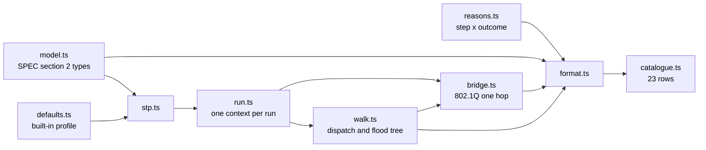
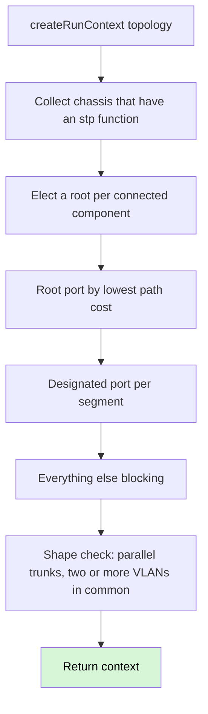
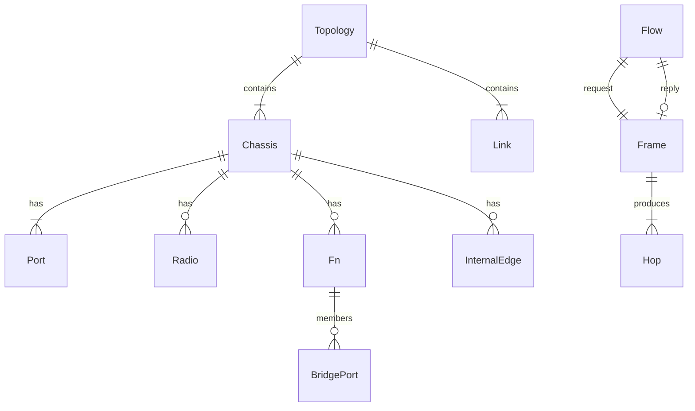

# Architecture

Headless TypeScript engine. Nothing here talks to a server. Persistence, when
it lands, is a JSON file the user keeps — there is no database.

This slice is the floor, the run context, one pass through a bridging
function, and the topology walk that follows links.

## Modules

| Module | Holds |
|---|---|
| `src/model.ts` | Topology, chassis, functions, frames, hops, flows. `nativeVlanOf` derives native VLAN from `untaggedVlans` — the field is not stored. |
| `src/reasons.ts` | `PIPELINE_STEPS`, `OUTCOMES`, `ReasonCode` as their product. |
| `src/defaults.ts` | Every tunable the engine will read, including encapsulation overheads. Named `ieee-defaults` v1 (ADR 0012). |
| `src/format.ts` | Turns a structured hop, trace, flow or warning into a sentence. |
| `src/catalogue.ts` | The 23-row table. Row 20 is Stage 2. |
| `src/stp.ts` | Converged 802.1D: root, root port, designated port, else blocking. Single instance. ADR 0011 warning. |
| `src/run.ts` | One context per run: FDB, resolved MACs, hop budget, STP map, warnings. Discarded when the run ends. |
| `src/bridge.ts` | One pass through one bridging function: STP ingress, acceptable frames, PVID, ingress filtering, learn, lookup, STP egress, membership, tagging. |
| `src/walk.ts` | Dispatcher: read `Port.ownedBy`, hand the frame to that function's executor. Floods are a tree. `hopsLeft` is one budget across every branch. |

There is no `switch (device.kind)`. There are no device kinds. A chassis
carries functions; the walk dispatches on `Port.ownedBy`. A chassis with
no `stp` function never appears in the STP map, so `portState` returns
`forwarding` — the absence of a function, not a special case. A loop
through two such chassis exhausts the hop budget because nothing blocked
the redundant link.

## Run

STP port state is three values that exist without a clock: `forwarding`,
`blocking`, `disabled` (ADR 0003). Listening and learning are absent.
Disabled means the member port has no link. A linked port that is the only
STP attachment on its LAN (an edge port facing a host or a chassis with no
`stp` function) is designated and forwards — blocking exists to remove
redundant bridge-to-bridge paths, not to black-hole access ports. The
computed map lives on the run context; the topology is not mutated.

## Data model

In-memory today; the same graph is what a JSON export will round-trip.

## Tests

Per [ADR 0017](adr/0017-structure-in-engine-tests-wording-against-the-table.md):
structural assertions name device, function, pipeline step, reason code, VLAN,
port and action, and contain no prose. Wording assertions compare `format(...)`
to `row.expected` on the catalogue table. Rows 2, 5, 6, 16 and 17 are traces
assembled from a walk. Row 19 is a warning, not a hop.

PVID is ingress only. Egress tagged/untagged is `untaggedVlans`. A VLAN ID of
0 is priority-tagged and is classified to the PVID, matching 802.1Q; that case
is not in the catalogue. `vlanAware: false` makes membership tests vacuous
and leaves the on-wire tag untouched.
