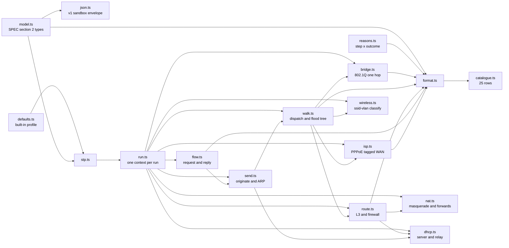
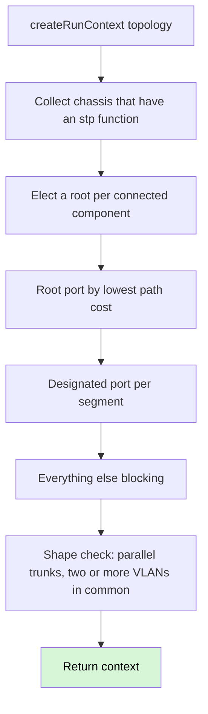
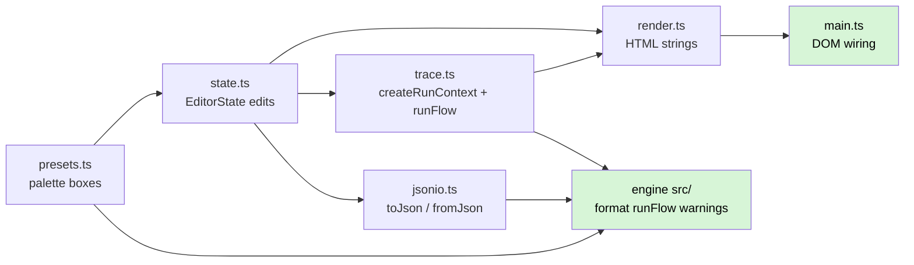
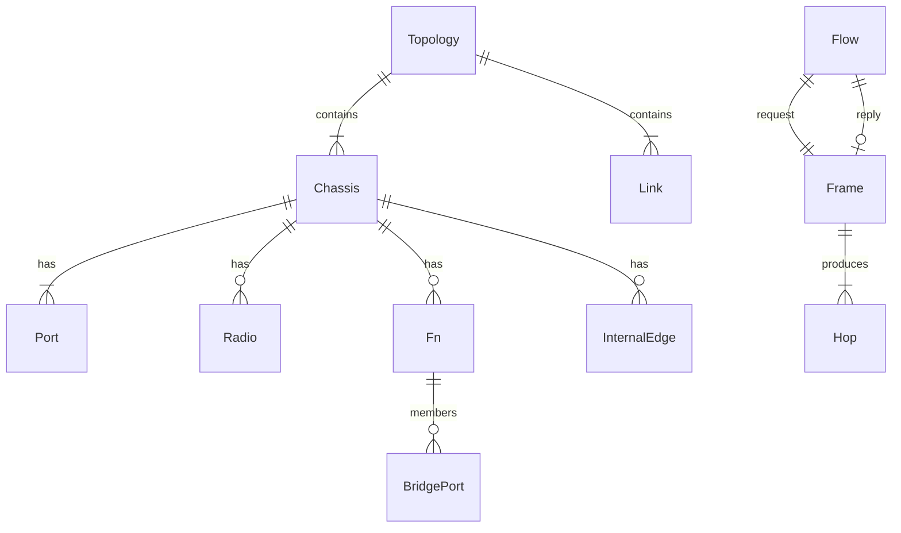

# Architecture

Headless TypeScript engine. Nothing here talks to a server. Persistence is a
JSON file the user keeps — there is no database. The in-memory Topology is
that file: `toJson` / `fromJson` round-trip it through the version-1 sandbox
envelope `{format, version, topology}`.

This slice is the floor, the run context, one pass through a bridging
function, the topology walk that follows links, L3: hosts, ARP, routing
and the inter-VLAN firewall, the flow driver that traces a request
and its reply against one run context, NAT (masquerade plus port
forwards), DHCP as a message exchange (no leases), the ISP handoff
(PPPoE and a tagged WAN), a fixture profile seam, the reference
scenario (SPEC.md §9, including AP, mesh and a second WAN), wireless
dispatch: classify at `ssid-vlan`,
then follow `InternalEdge` onto the chassis bridge, a tagged AP
uplink, AP management as existing host delivery on the chassis
VLAN, and untagged-only as `canTag: false` on bridging (catalogue
row 20). `Link.up` (omitted is up) makes down a link property: the walk
does not traverse a down link, STP computes as if it were not drawn, and
a route whose via sits behind one is not a candidate — failover as two
runs of one topology (ADR 0003, ADR 0020; catalogue row 25). The estimate
seam keeps assumed output out of the trace's language: an `Estimate` is
not a `FormatInput` and formats only through `formatEstimate` (ADR 0024).

## Modules

| Module | Holds |
|---|---|
| `src/model.ts` | Topology, chassis, functions, frames, hops, flows. `nativeVlanOf` derives native VLAN from `untaggedVlans` — the field is not stored. Chassis `vlan` is the VLAN host addressing answers on. `Link.up` is omitted-is-up: down is a link property, not a device role (ADR 0020). |
| `src/json.ts` | Version-1 sandbox envelope `{format, version, topology}`. `taggedVlans` / `untaggedVlans` encode as number arrays. `fdb` and `stp.state` are omitted on write and empty Maps on parse. Unknown `fn.kind` and unsupported versions fail by name (`UnknownFunctionKindError`, `UnsupportedSandboxVersionError`). No AJV, no `$set` markers (ADR 0026). |
| `src/reasons.ts` | `PIPELINE_STEPS`, `OUTCOMES`, `ReasonCode` as their product. |
| `src/defaults.ts` | Every tunable the engine will read, including encapsulation overheads. Named `ieee-defaults` v1 (ADR 0012). `unmanagedTag: 'pass'` is the built-in capability; a fixture profile may select `'strip'`. Usable MTU is computed, never stored. |
| `src/format.ts` | Turns a structured hop, trace, flow or warning into a sentence. An `Estimate` (`kind: 'estimate'`, non-empty `assumptions`) is not a `FormatInput` and never passes through `format` — `formatEstimate` renders it, naming itself and listing its assumptions (ADR 0024). |
| `src/catalogue.ts` | The 26-row table. Row 20 is Stage 2; rows 24-26 are Stage 3. |
| `src/stp.ts` | Converged 802.1D: root, root port, designated port, else blocking. Single instance. ADR 0011 warning. An SVI bridging member (its port owned by the routing function) is not an STP port — port roles belong to link attachments only, and the SVI is the bridge's internal interface to the route processor. |
| `src/run.ts` | One context per run: FDB, resolved MACs, pending L3 sends, NAT sessions, hop budget, STP map, warnings, the active profile. Discarded when the run ends. |
| `src/bridge.ts` | One pass through one bridging function: STP ingress, acceptable frames, PVID, ingress filtering, learn, lookup, STP egress, membership, tagging. `canTag: false` keeps the classified VLAN and emits untagged. |
| `src/walk.ts` | Dispatcher: read `Port.ownedBy`, hand the frame to that function's executor. A `wireless` function classifies at `ssid-vlan` and the walk follows `InternalEdge` onto the chassis bridge — still dispatch on the function, never `device.kind`. Floods are a tree. `hopsLeft` is one budget across every branch. Hosts with addressing answer ARP and take delivery. The fallback dispatch also answers a same-VLAN DHCP DISCOVER on a chassis whose `dhcp-server` function has a matching scope (classified VLAN is the frame's tag, else the chassis' addressing VLAN) — the OFFER leaves the arrival port; a routing chassis never runs this branch (its ports dispatch to `routing`, which keeps `decideDhcp`). A bridge-embedded DHCP server (issue #79) answers too: after bridge ingress classification, the same post-classification seam as the SVI composition consults the co-resident server — the OFFER fires while the DISCOVER still floods to every other member port (flood + answer, never answer-instead-of-flood; the predicate stays `standaloneDhcpDecision`'s narrow conditions, so the answer never steals frames the server would not take). SVI composition (issue #71): after bridge ingress classification, a chassis routing function is reachable from the bridging ports for exactly two frame shapes — an ARP for a routing iface's IP on that iface's VLAN, and a frame addressed to a routing iface's MAC; the first answers with the SVI's MAC, the second hands the frame to `routeFrame` at the SVI port (the frame carries the bridge-classified VLAN), and routed egress out an SVI re-enters the chassis bridge through the `rt`→`br` InternalEdge. Every other frame bridges exactly as before. After a bridging `destination-lookup` drop, a chassis whose host addressing is on that VLAN still takes `arp`/`delivery` — not a management step. An arrival whose `ownedBy` cannot handle the frame is named as a hop on that chassis, not swallowed. Observations are keyed by name and facts, so two VLAN leaks on one walk both surface. When the previous device classified at `ssid-vlan`, its bridging function has `canTag: false`, and the far end's PVID differs, the observation is `ssid-untagged` (mapped vs landed VLAN), not `vlan-leak`. `stp-root` is the blocked STP link plus the elected root the walk transited, not BFS hop order. Egress toward an `isp-handoff` in `pppoe` mode adds that layer; a frame larger than `usableMtu` drops at `mtu`. `peerOf` returns no peer across a link marked `up: false`, so no frame traverses a down link (ADR 0020). |
| `src/ip.ts` | IPv4 parse, subnet membership, longest-prefix match. No library. |
| `src/route.ts` | One pass through one routing function: tagged sub-interface match, ARP, DHCP, connected then static LPM - a route carrying the frame VLAN's `fromVlan` selector beats any destination-only route - inter-VLAN allow/deny, then NAT. A connected iface on a down link, and a route whose via resolves to a down-link iface, are not candidates; the drop stays `route-lookup` and names the skipped default (ADR 0020, row 25). An equal-prefix tie in the tier that decided the frame picks the first reachable route in `routes[]` order and the hop names that via - never a split ratio (ADR 0021, row 26). |
| `src/nat.ts` | NAT function on a routing function. Masquerade out any iface a default route names (ADR 0022): the selector-aware pick for the frame's VLAN, the plain default, or another WAN reached by a longer-prefix static or selector route - the set skips defaults whose via sits behind a down link, so masquerade follows failover (ADR 0020). Port-forwards match `proto` and `outsidePort` against any default-named WAN's public IP; a DNAT arrived at from an internal iface is hairpin - source rewritten to the egress iface IP, the return session recorded with the original public destination, and the reply re-enters the router (ADR 0022). Sessions live on the run context. A session from a service payload records the port tuple (proto, toPort, clientPort, outsidePort for DNAT); a return leg carrying ports matches it exactly, a portless frame matches only portless sessions first-wins - named on the hop when ambiguous - and the reply's source port is restored to the contacted port (ADR 0023). |
| `src/dhcp.ts` | DHCP server and relay as functions — siblings of routing when mounted on a router, or standalone on a host-like chassis (`standaloneDhcpDecision`, reached through the walk's fallback dispatch), and bridge-embedded: the walk's post-ingress seam consults a co-resident server after bridging classification, answering with the flood preserved (issue #79). DISCOVER/OFFER/REQUEST/ACK are frames. An OFFER is `poolStart` from the matching scope. No lease record. A standalone server with divergent multi-scope VLANs answers only on `chassis.vlan` — one identity, one VLAN (RFC 2131 s4.3.1); import warns on the shape. |
| `src/isp.ts` | ISP handoff. The named `port` faces the customer; other ports owned by the function face the provider. A missing `vlanTag` or a PPPoE IP frame without that layer drops at `isp-handoff`. |
| `src/send.ts` | Originate from a sender. ARP only when the next-hop MAC is unknown. DHCP DISCOVER is broadcast. |
| `src/flow.ts` | Request then ICMP reply against one run context. Outcomes name which direction died; they are not pass/fail. |
| `src/host.ts` | Host chassis (no functions) answering ARP and taking delivery. |
| `src/wireless.ts` | One pass through a wireless function: SSID to VLAN at `ssid-vlan`, then `InternalEdge` onto the chassis bridge. Not a second forwarder. Radio may store a configured channel (not an RF claim, ADR 0025). Radio and link carry no power or coverage. |

There is no `switch (device.kind)`. There are no device kinds. A chassis
carries functions; the walk dispatches on `Port.ownedBy`. A chassis with
no `stp` function never appears in the STP map, so `portState` returns
  `forwarding` — the absence of a function, not a special case. A loop
through two such chassis exhausts the hop budget because nothing blocked
the redundant link. The `loop` observation is gated on chassis that took
the most revisits in that storm, not every chassis the walk touched — an
STP box on the way in does not hide an unmanaged cycle.

## Run

STP port state is three values that exist without a clock: `forwarding`,
`blocking`, `disabled` (ADR 0003). Listening and learning are absent.
Disabled means the member port has no link. A linked port that is the only
STP attachment on its LAN (an edge port facing a host or a chassis with no
`stp` function) is designated and forwards — blocking exists to remove
redundant bridge-to-bridge paths, not to black-hole access ports. The
computed map lives on the run context; the topology is not mutated.

## Browser UI

The UI is a separate entry under `ui/` that imports the engine and never the
other way round (ADR 0016, ADR 0027). Behaviour lives in pure, unit-tested
modules; `main.ts` is the only DOM-glue module. Presets write functions, not a
device kind (ADR 0013): the palette includes the managed switch, the
unmanaged switch, the router (routing+nat), the L3 switch (bridging+stp+routing
with SVI-shaped rt-owned bridging members — the #71 composition), the
standalone DHCP server (host-like addressing plus a `dhcp-server` scope — the
#72 composition, with scope-editing controls), the AP and the modem; the
inspector keeps PVID and `untaggedVlans` as separate
controls (ADR 0008); Start link is per free port (router `wan` can be first);
router WAN VLAN is `RouterIface.vlan`, not PVID; SVI-shaped ifaces (an rt-owned
port that is also a bridging member) render no independent VLAN control on
either half — neither the sub-interface VLAN input nor the bridge-member
PVID/tagged/untagged inputs — because the SVI is one mechanism and either edit
alone would desynchronise `iface.vlan` from the member's carried VLANs (routed
egress is gated by the member's VLANs at egress-membership); editing a
dhcp-server scope's vlan moves the chassis addressing VLAN with it, because
the engine's standalone answer gates on `chassis.vlan` and a drifted scope
could never answer; the modem inspector names the
ISP check (`mode` + required VLAN); the trace panel offers two send types —
ICMP echo to a destination IP, or DHCP DISCOVER, a broadcast that hides the
destination input and renders request hops only (the flood path and the
OFFERs; the observation sentences arrive with #63) — and renders the engine's
own sentences — hops
from the walk, observations and the ADR 0011 warning through `format()` — plus
the cold-trace notice (ADR 0010) and the no-timers notice. An stp-function
chassis renders an STP priority control (function presence, never preset id —
the unmanaged switch stays bare); every bridge-member port renders its
Acceptable frame types admission rule and the Ingress filtering flag, because
one control edits one 802.1Q mechanism (ADR 0008). There is no canvas
and no layout state: the Topology JSON is the file, and `ui/jsonio.ts` hands it
to the same `toJson` / `fromJson` envelope as everything else.

## Data model

The in-memory graph is the file. `toJson` writes the version-1 envelope;
`fromJson` parses it back. Canvas coordinates are not Topology. Runtime
Maps (`fdb`, `stp.state`) are not persisted — `createRunContext` rebuilds
them.

## Tests

Per [ADR 0017](adr/0017-structure-in-engine-tests-wording-against-the-table.md):
structural assertions name device, function, pipeline step, reason code, VLAN,
port and action, and contain no prose. Wording assertions compare `format(...)`
to `row.expected` on the catalogue table. Rows 2, 5, 6, 16 and 17 are traces
assembled from a walk. Rows 1, 4 and 18 are end-to-end walk fixtures too —
`src/walk.test.ts` builds each topology, learns what the walk would have
learned, and asserts the hop structurally plus the verbatim catalogue
sentence (row 1 egress-membership, row 4 ingress-filtering admitted with a
delivery on the trunk, row 18 tagged-only ingress drop). Row 20 is a trace assembled from a walk
(`src/mesh.test.ts`, and again in the reference fixture). Row 7 is a trace assembled from `send`. Rows 9, 13 and 15
are flows assembled from `runFlow`. Rows 10 and 12 are traces from `send`.
Rows 3, 8, 11 and 14 are traces from a DHCP DISCOVER `send`. Row 23 is a
firewall hop after a query to the advertised resolver. Rows 21 and 22 are hops.
Row 19 is a warning, not a hop. Row 25 is a `route-lookup` drop on a
multi-WAN router with WAN1's link marked `up: false` and no second default;
the failover runs (`src/wan.test.ts`) show WAN1 down with a WAN2 default
taking WAN2, and a selector route targeting the down WAN going unused.
Row 26 is the equal-cost tie: two VLAN 10 selector defaults, both up,
forward via the first in `routes[]` order — repeatable, verbatim in
`src/wan.test.ts`. The §9 fixture itself now carries WAN2 — a second
`isp-handoff` in static mode plus a second default — and the working
traces sit beside rows 24 and 25: a VLAN 30 selector forwarding out
WAN2 with WAN1 up, and WAN1 down taking WAN2 through the second
handoff.

PVID is ingress only. Egress tagged/untagged is `untaggedVlans`. A VLAN ID of
0 is priority-tagged and is classified to the PVID, matching 802.1Q; that case
is not in the catalogue. `vlanAware: false` makes membership tests vacuous
and leaves the on-wire tag untouched unless the active profile selects
`unmanagedTag: 'strip'` — then the hop carries `provenance`.
`canTag: false` is a separate capability: membership still uses VLANs,
egress is always untagged. A preset writes that field; the engine does
not branch on a vendor name. The
reference scenario (SPEC.md §9, including AP, mesh and a second WAN) is `src/wan.fixture.ts`.
Row 5 reproduces there as well as in `walk.test.ts`; row 20 reproduces
there as well as in `src/mesh.test.ts`. Tagged AP uplink and
management VLAN (issue #30, no catalogue row) are `src/ap.test.ts`.
Sandbox JSON round-trip is `src/json.test.ts`: Sets survive as arrays,
Maps stay out of the file, unknown kinds and unsupported versions fail
by name, and the §9 fixture's `send` hops match after parse.
