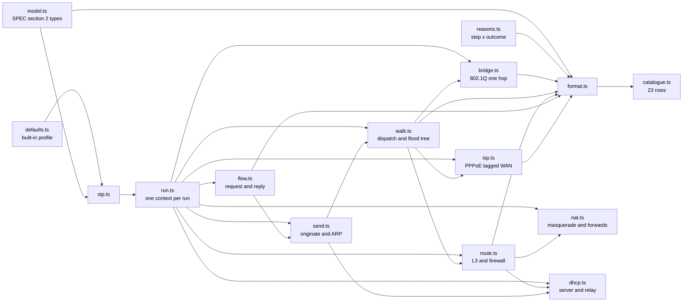
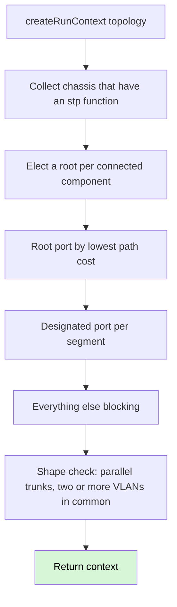
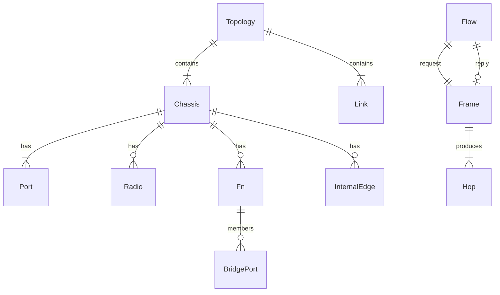

# Architecture

Headless TypeScript engine. Nothing here talks to a server. Persistence, when
it lands, is a JSON file the user keeps — there is no database.

This slice is the floor, the run context, one pass through a bridging
function, the topology walk that follows links, L3: hosts, ARP, routing
and the inter-VLAN firewall, the flow driver that traces a request
and its reply against one run context, NAT (masquerade plus port
forwards), DHCP as a message exchange (no leases), the ISP handoff
(PPPoE and a tagged WAN), a fixture profile seam, and the wired
reference scenario.

## Modules

| Module | Holds |
|---|---|
| `src/model.ts` | Topology, chassis, functions, frames, hops, flows. `nativeVlanOf` derives native VLAN from `untaggedVlans` — the field is not stored. |
| `src/reasons.ts` | `PIPELINE_STEPS`, `OUTCOMES`, `ReasonCode` as their product. |
| `src/defaults.ts` | Every tunable the engine will read, including encapsulation overheads. Named `ieee-defaults` v1 (ADR 0012). `unmanagedTag: 'pass'` is the built-in capability; a fixture profile may select `'strip'`. Usable MTU is computed, never stored. |
| `src/format.ts` | Turns a structured hop, trace, flow or warning into a sentence. |
| `src/catalogue.ts` | The 23-row table. Row 20 is Stage 2. |
| `src/stp.ts` | Converged 802.1D: root, root port, designated port, else blocking. Single instance. ADR 0011 warning. |
| `src/run.ts` | One context per run: FDB, resolved MACs, pending L3 sends, NAT sessions, hop budget, STP map, warnings, the active profile. Discarded when the run ends. |
| `src/bridge.ts` | One pass through one bridging function: STP ingress, acceptable frames, PVID, ingress filtering, learn, lookup, STP egress, membership, tagging. |
| `src/walk.ts` | Dispatcher: read `Port.ownedBy`, hand the frame to that function's executor. Floods are a tree. `hopsLeft` is one budget across every branch. Hosts with addressing answer ARP and take delivery. An arrival whose `ownedBy` cannot handle the frame is named as a hop on that chassis, not swallowed. Observations are keyed by name and facts, so two VLAN leaks on one walk both surface. `stp-root` is the blocked STP link plus the elected root the walk transited, not BFS hop order. Egress toward an `isp-handoff` in `pppoe` mode adds that layer; a frame larger than `usableMtu` drops at `mtu`. |
| `src/ip.ts` | IPv4 parse, subnet membership, longest-prefix match. No library. |
| `src/route.ts` | One pass through one routing function: tagged sub-interface match, ARP, DHCP, connected then static LPM, inter-VLAN allow/deny, then NAT. |
| `src/nat.ts` | NAT function on a routing function. Masquerade out the default-route iface; port-forwards match `proto` and `outsidePort`. Sessions live on the run context. |
| `src/dhcp.ts` | DHCP server and relay as sibling functions of routing. DISCOVER/OFFER/REQUEST/ACK are frames. An OFFER is `poolStart` from the matching scope. No lease record. |
| `src/isp.ts` | ISP handoff. The named `port` faces the customer; other ports owned by the function face the provider. A missing `vlanTag` or a PPPoE IP frame without that layer drops at `isp-handoff`. |
| `src/send.ts` | Originate from a sender. ARP only when the next-hop MAC is unknown. DHCP DISCOVER is broadcast. |
| `src/flow.ts` | Request then ICMP reply against one run context. Outcomes name which direction died; they are not pass/fail. |
| `src/host.ts` | Host chassis (no functions) answering ARP and taking delivery. |

There is no `switch (device.kind)`. There are no device kinds. A chassis
carries functions; the walk dispatches on `Port.ownedBy`. A chassis with
no `stp` function never appears in the STP map, so `portState` returns
  `forwarding` — the absence of a function, not a special case. A loop
through two such chassis exhausts the hop budget because nothing blocked
the redundant link. The `loop` observation is gated on chassis that took
the most revisits in that storm, not every chassis the walk touched — an
STP box on the way in does not hide an unmanaged cycle.

## Run

STP port state is three values that exist without a clock: `forwarding`,
`blocking`, `disabled` (ADR 0003). Listening and learning are absent.
Disabled means the member port has no link. A linked port that is the only
STP attachment on its LAN (an edge port facing a host or a chassis with no
`stp` function) is designated and forwards — blocking exists to remove
redundant bridge-to-bridge paths, not to black-hole access ports. The
computed map lives on the run context; the topology is not mutated.

## Data model

In-memory today; the same graph is what a JSON export will round-trip.

## Tests

Per [ADR 0017](adr/0017-structure-in-engine-tests-wording-against-the-table.md):
structural assertions name device, function, pipeline step, reason code, VLAN,
port and action, and contain no prose. Wording assertions compare `format(...)`
to `row.expected` on the catalogue table. Rows 2, 5, 6, 16 and 17 are traces
assembled from a walk. Row 7 is a trace assembled from `send`. Rows 9, 13 and 15
are flows assembled from `runFlow`. Rows 10 and 12 are traces from `send`.
Rows 3, 8, 11 and 14 are traces from a DHCP DISCOVER `send`. Row 23 is a
firewall hop after a query to the advertised resolver. Rows 21 and 22 are hops.
Row 19 is a warning, not a hop.

PVID is ingress only. Egress tagged/untagged is `untaggedVlans`. A VLAN ID of
0 is priority-tagged and is classified to the PVID, matching 802.1Q; that case
is not in the catalogue. `vlanAware: false` makes membership tests vacuous
and leaves the on-wire tag untouched unless the active profile selects
`unmanagedTag: 'strip'` — then the hop carries `provenance`. The wired
reference scenario (SPEC.md §9 minus AP and mesh) is `src/wan.test.ts`. Row 5
reproduces there as well as in `walk.test.ts`.
