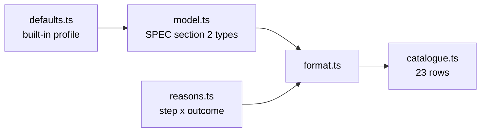
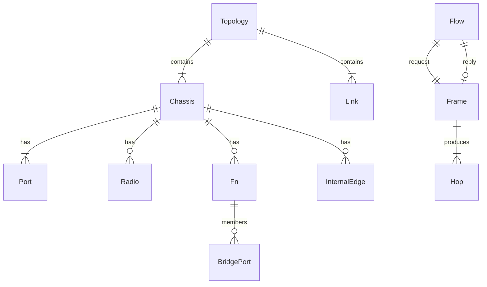

# Architecture

Headless TypeScript engine. Nothing here talks to a server. Persistence, when
it lands, is a JSON file the user keeps — there is no database.

This slice (GitHub #2) is the floor: types, reason codes, the catalogue
table, `format`, and the built-in defaults profile. The 802.1Q pipeline
itself is #4; the walk is #5; STP is #3.

## Modules

| Module | Holds |
|---|---|
| `src/model.ts` | Topology, chassis, functions, frames, hops, flows. `nativeVlanOf` derives native VLAN from `untaggedVlans` — the field is not stored. |
| `src/reasons.ts` | `PIPELINE_STEPS`, `OUTCOMES`, `ReasonCode` as their product. |
| `src/defaults.ts` | Every tunable the engine will read, including encapsulation overheads. Named `ieee-defaults` v1 (ADR 0012). |
| `src/format.ts` | Turns a structured hop, trace, flow or warning into a sentence. |
| `src/catalogue.ts` | The 23-row table. Row 20 is Stage 2. |

There is no `switch (device.kind)`. There are no device kinds. A chassis
carries functions; later issues dispatch on `Port.ownedBy`.

## Data model

In-memory today; the same graph is what a JSON export will round-trip.

STP port state is three values that exist without a clock: `forwarding`,
`blocking`, `disabled` (ADR 0003). Listening and learning are absent.

## Tests

Per [ADR 0017](adr/0017-structure-in-engine-tests-wording-against-the-table.md):
structural assertions live in engine tests (none yet — no engine); wording
assertions compare `format(row.example)` to `row.expected` on the catalogue
table. Those wording checks are green in this slice so later issues can
reuse them.
