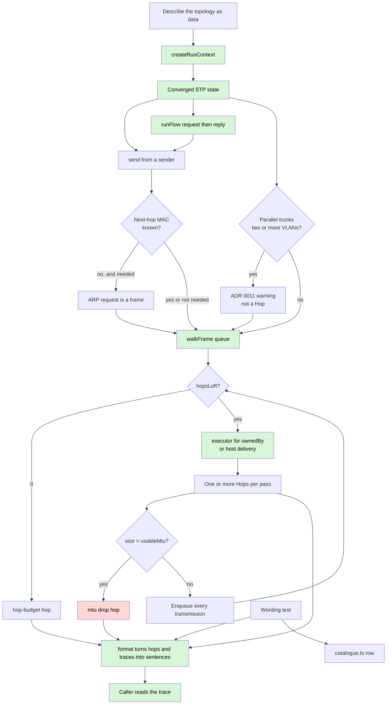
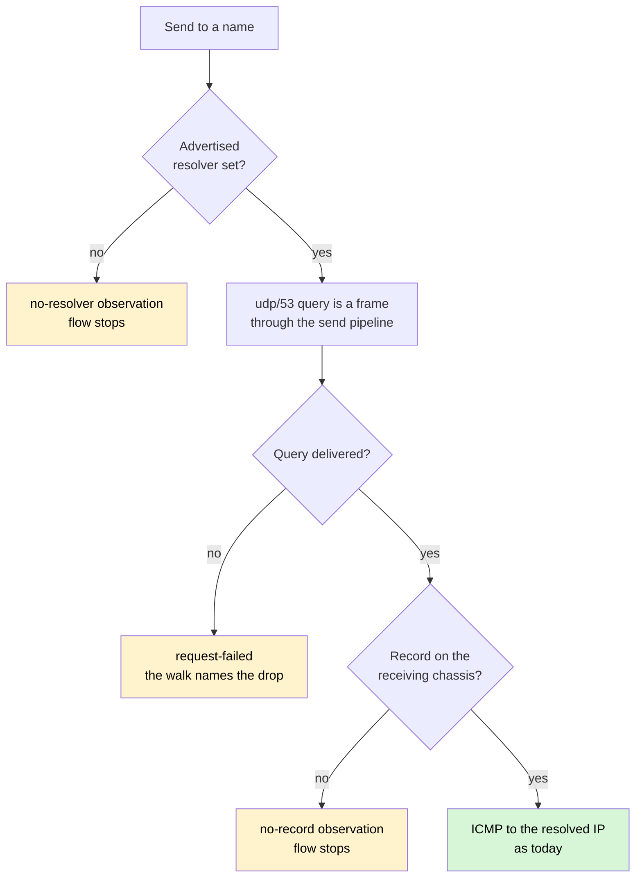
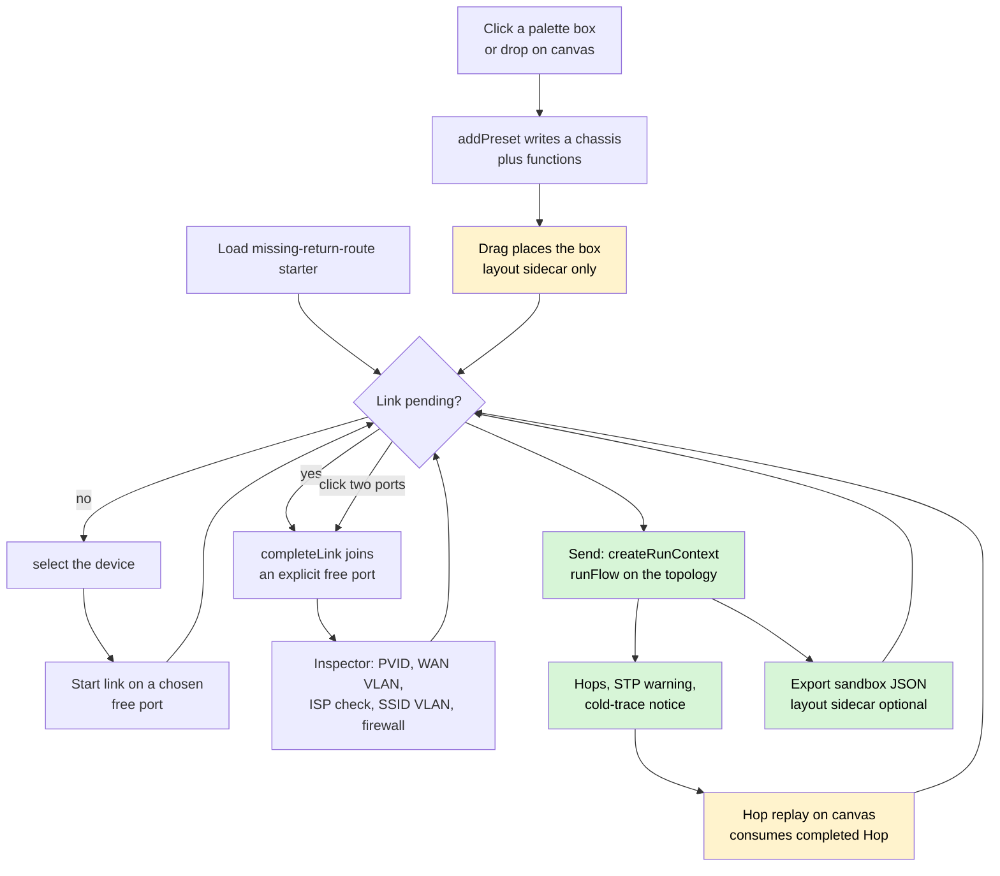
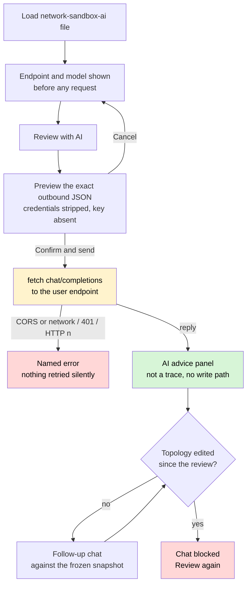
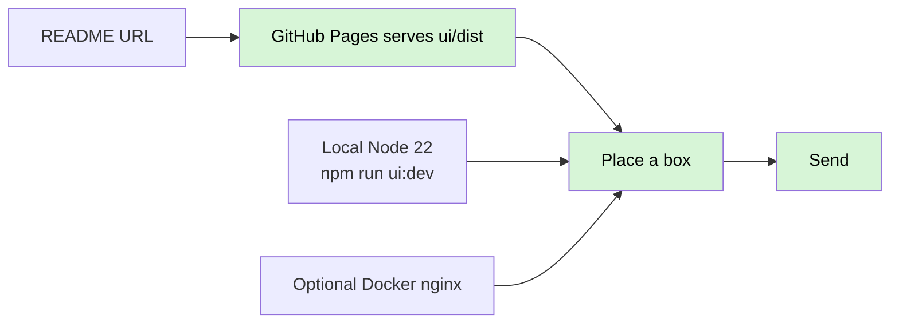

# System flow

The product workflow from [`PRODUCT.md`](PRODUCT.md). `createRunContext`
computes spanning tree before any frame exists. `send` originates from a
host or other sender and ARPs only when that sender lacks its next-hop MAC.
The sender's own hop leads the trace — `origin:forwarded`, rendered as
`sent from <host> port <n>` — so hop 0 names who sent the frame, not the
first device it reached (#123); a send that never handed a frame to the
walk records no origin hop.
`runFlow` sends a request, then — if it was delivered — the ICMP reply,
against that same context, and returns every observation in a
deterministic order: the request walk's, then the reply walk's, then the
flow-level ones (#63). `walkFrame` follows links and dispatches each
arrival on `Port.ownedBy`. An arrival that no executor will handle is still
a hop on that chassis — the walk does not swallow it. `bridgeFrame` is one hop through one bridging
function; `routeFrame` is one hop through one routing function, including
NAT masquerade and port-forwards when a `nat` function is present, and
DHCP when a `dhcp-server` or `dhcp-relay` function is present. A chassis
with a `dhcp-server` function and no routing answers a same-VLAN DHCP
DISCOVER itself — the OFFER leaves the arrival port; reachability is
honest, a different VLAN needs the relay path. An L3 switch is
composition, not a device kind: a bridging+routing chassis reaches its
routing function from the bridging ports through SVIs — an ARP for an SVI
IP is answered with the SVI's MAC, a frame addressed to an SVI MAC routes,
and routed egress re-enters the chassis bridge; STP still gates the
bridging ports. `handoffFrame`
is one hop through an `isp-handoff`. `classifyWireless` is one hop through a
`wireless` function at `ssid-vlan`; the walk then follows `InternalEdge` onto
the chassis bridge. A bridging function with `canTag: false` still
classifies the VLAN and emits untagged; the far end's PVID is the
landed VLAN. After bridging, a `destination-lookup` drop on a chassis
addressed on that VLAN is existing host `arp`/`delivery`, not a management
step. A DHCP
DISCOVER is a broadcast; OFFER, REQUEST and ACK are unicast frames in the
same run. There is no lease record. Usable MTU is computed from the
encapsulation stack at egress; an oversized frame drops at `mtu`.

A wireless client is a host. `send` originates from it the same way as
from a wired host; the first hop is `ssid-vlan` on the AP or mesh node
the client joined. The SPEC.md §9 reference fixture includes both boxes:
a tagged-capable AP with three SSIDs, and two consumer mesh nodes on a
`medium: 'wireless'` backhaul that cannot tag.

A link marked `up: false` is not part of any run: `walkFrame` never
enqueues a frame across one, STP computes as if it were not drawn, and a
route whose via sits behind one is not a candidate — the drop is still
`route-lookup` and names the skipped default (ADR 0020). Failover is two
runs of one topology, not a transition (ADR 0003): WAN1 down with no
second default is catalogue row 25; WAN1 down with a WAN2 default takes
WAN2, masquerade included. The §9 fixture carries both WANs — WAN1 is
PPPoE over tagged VLAN 500, WAN2 an untagged static `isp-handoff` — and
the working traces sit beside rows 24 and 25: a VLAN 30 selector route
forwarding guest traffic out WAN2 with WAN1 up, and the WAN1-down
failover delivered through the second handoff.

A drop is an outcome, not an error. The hop names the pipeline step that
produced it. There is no pass/fail field on a hop.

A flow — request plus reply sharing one run context — is how rows 9, 13 and
15 are seen. `runFlow` is that driver. The reply reads the FDB, resolved
MACs and NAT sessions the request populated; a reply traced cold floods.
The dest replies to the source address it actually received, so a masqueraded
request comes home without a return route. When the dest is a routing
chassis — the ping targeted the router itself — the reply originates
through the router's own routing function (#129): route lookup, the
pending-ARP machinery, and SVI egress re-entry run as for any routed frame.
`Flow.outcome` names which direction died. It is not a pass/fail field.

Sending to a **name** (issue #126) is two walks in one run (ADR 0030):
the destination is first a udp/53 `service` frame to the sender's
advertised resolver, and only a **delivered** query consults the
receiving chassis' record table. The resolved IP then feeds the ICMP
echo leg as usual; `Flow.query` carries the query frame so the trace
shows both walks in order. A sender with no advertised resolver, a query
that never arrives, and a table without the name each stop the flow
where it died — the trace, not a verdict, says which.

## UI loop

The browser UI runs the same engine, driven by clicks. The shipped loop is:
place a preset box, or load the missing-return-route starter (ADR 0005 content), set its jack counts — a market-SKU port count on a pure
managed or unmanaged switch, LAN count and WAN count on a router (the LAN
jacks join one bridge, extra WANs are routed uplinks, ADR 0031) — link two
free ports, edit in the inspector, send, read
sentences, export. An SVG canvas **view** draws chassis faces, ports and sagged cables
from `{topology, layout, selected}` (`ui/canvas.ts`); missing layout uses
`autoPlace` for display only. Wheel zoom and empty-drag pan move a
session-only camera; they do not write layout. After Send, hop replay rides a packet along
the cable between recorded `Hop[]` (play/step/pause) — it is not a clock (ADR 0003) and not
a verdict (ADR 0002). The live cable also carries a marching-chevron
overlay from the hop's origin toward its destination (#122); the wired
live stroke stays solid (#119). The canvas is also the builder: drop a palette preset, click two ports to
link, drag a box (layout only). Flood replay draws one token per recorded flood hop on that
device (concurrent if the walk emitted several); it does not invent copies. The topology never leaves the tab except as the
sandbox JSON file (optional `layout` sidecar).

## Optional AI review

The AI path is opt-in and user-triggered ([ADR 0033](adr/0033-ai-advice-sits-beside-the-engine.md)).
Nothing leaves the tab until a config is loaded **and** a preview is confirmed.
The payload is allowlist-built in `ui/ai.ts`: `isp-handoff` credentials have no
encoder line, so they cannot be serialized out. Catalogue rows ride along only
when the last trace supports them (hop step+action, or an observation/warning
code); a topology-only review carries none. The reply renders in its own panel,
labelled advice — never in the hop list's language. Failures are named
(CORS-or-network, 401, HTTP status); no vendor CORS matrix is claimed anywhere.

## Opening the sandbox

A visitor opens the README URL. Local Node and optional Docker remain clone
paths. None of them add a server, an account, or persistence.

