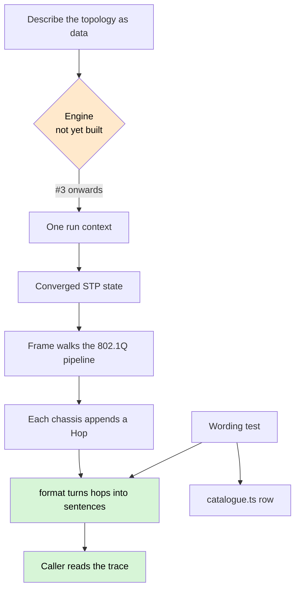

# System flow

The product workflow from [`PRODUCT.md`](PRODUCT.md). The engine call is a
hole until #3–#7 land; `format` and the catalogue already sit at the end of
it, which is why they shipped first.

A drop is an outcome, not an error. The hop names the pipeline step that
produced it. There is no pass/fail field on a hop.

A flow — request plus reply sharing one run context — is how rows 9, 13 and
15 are seen. That driver is #7.
