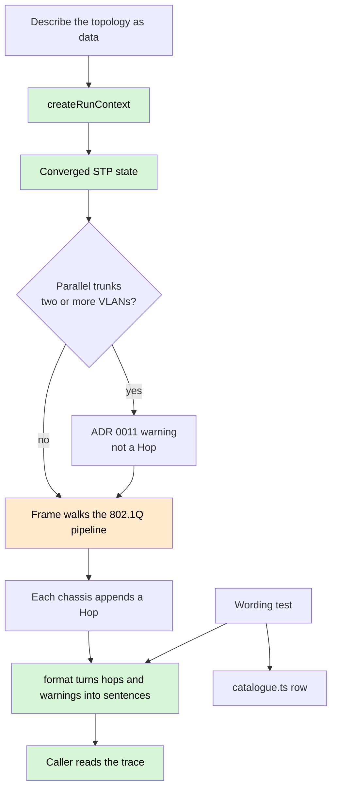

# System flow

The product workflow from [`PRODUCT.md`](PRODUCT.md). `createRunContext`
computes spanning tree before any frame exists. The 802.1Q pipeline itself
is still a hole (#4, #5).

A drop is an outcome, not an error. The hop names the pipeline step that
produced it. There is no pass/fail field on a hop.

A flow — request plus reply sharing one run context — is how rows 9, 13 and
15 are seen. That driver is #7.
