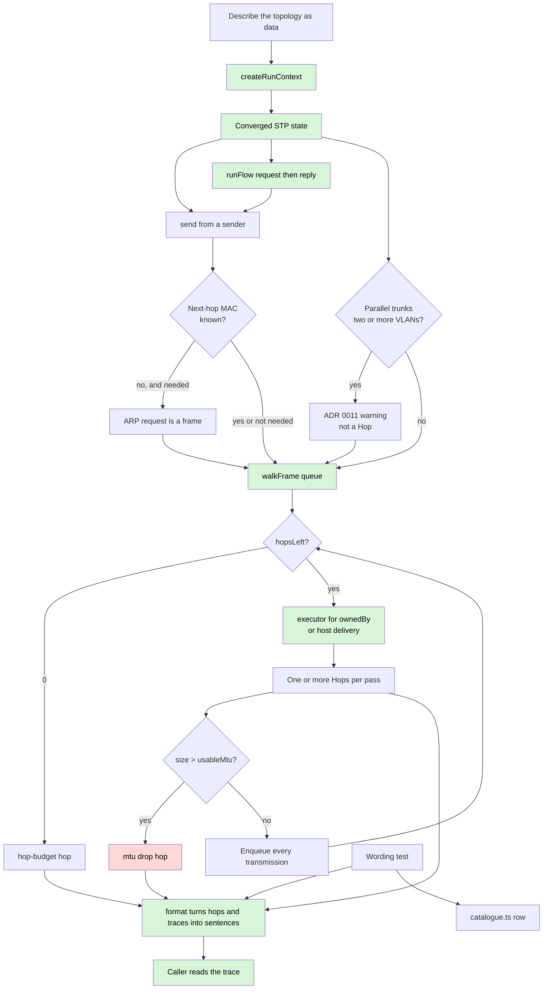

# System flow

The product workflow from [`PRODUCT.md`](PRODUCT.md). `createRunContext`
computes spanning tree before any frame exists. `send` originates from a
host or other sender and ARPs only when that sender lacks its next-hop MAC.
`runFlow` sends a request, then — if it was delivered — the ICMP reply,
against that same context. `walkFrame` follows links and dispatches each
arrival on `Port.ownedBy`. An arrival that no executor will handle is still
a hop on that chassis — the walk does not swallow it. `bridgeFrame` is one hop through one bridging
function; `routeFrame` is one hop through one routing function, including
NAT masquerade and port-forwards when a `nat` function is present, and
DHCP when a `dhcp-server` or `dhcp-relay` function is present. `handoffFrame`
is one hop through an `isp-handoff`. `classifyWireless` is one hop through a
`wireless` function at `ssid-vlan`; the walk then follows `InternalEdge` onto
the chassis bridge. After bridging, a `destination-lookup` drop on a chassis
addressed on that VLAN is existing host `arp`/`delivery`, not a management
step. A DHCP
DISCOVER is a broadcast; OFFER, REQUEST and ACK are unicast frames in the
same run. There is no lease record. Usable MTU is computed from the
encapsulation stack at egress; an oversized frame drops at `mtu`.

A drop is an outcome, not an error. The hop names the pipeline step that
produced it. There is no pass/fail field on a hop.

A flow — request plus reply sharing one run context — is how rows 9, 13 and
15 are seen. `runFlow` is that driver. The reply reads the FDB, resolved
MACs and NAT sessions the request populated; a reply traced cold floods.
The dest replies to the source address it actually received, so a masqueraded
request comes home without a return route. `Flow.outcome` names which
direction died. It is not a pass/fail field.
